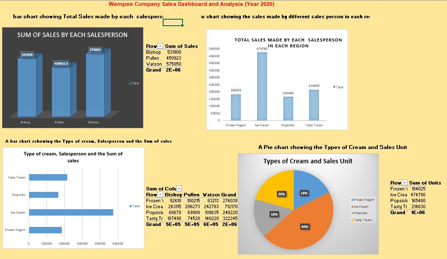

# Wempee Sales Analysis - Excel Dashboard

## Introduction

Wempee Company is a company that sells ice cream, frozen yogurt, popsicles, and other frozen treats. This project is designed to create an Excel dashboard to analyze sales data for Wempee Company. The data includes information about sales by month, year, product type, salesperson, region, and unit and dollar sales. The data used in this project is provided by Kaggle.com, a public repository for data sets.

## Problem Statement

Wempee Company needs a way to track and analyze their sales data in order to identify trends, make better business decisions, and improve profitability. An Excel dashboard will allow Wempee Company to see their sales data in a visual and easy-to-understand format.

## Skills Demonstrated

This project demonstrates the following skills:

- Businesss Understanding
- Client Communication
- Effective Communication
- Visualisation
- Data Analysis
- Data Interpretation
- Data Visualisation
- Charts & Graphs
- Creativity
- Visual Basics
- Dashboard
- Data Cleanup
- Analysis & Presentation
- Analytics & Insights
- Exploratoey Data Analysis

## Data Sourcing

The data for this project was obtained from Kaggle.com. The data is from a sales platform and includes information about sales by month, year, product type, salesperson, region, and unit and dollar sales.

## Data Transformation

The data was transformed in Excel using the following steps:

* Cleaning: The data was cleaned to remove any errors or inconsistencies.
* Formatting: The data was formatted to ensure that all dates and numbers were formatted consistently.
* PivotTables: Pivot tables were created to summarize the data by product type, salesperson, region, and other dimensions.
  
## Modeling

* No complex modeling was required for this project. However, pivot tables were used to create a model of the data that could be used to create charts and graphs.

## Analysis and Visualization

The following charts and graphs were created to visualize the data:

* A bar chart showing Total Sales made by each  salesperson							
* A bar chart showing the sales made by different sales person in each region								
* A bar chart schowing the Type of cream, Salesperson and the Sum of sales									
* A Pie chart showing the Types of Cream and Sales Unit	

These charts and graphs allow Wempee Company to see trends in their sales data and identify areas for improvement. For example, the company may see that they are selling more ice cream than frozen yogurt, or that they are selling more products in one region than another.

## Conclusion

The creation of this Excel dashboard has been successful in providing Wempee Company with a tool to track and analyze their sales data. This dashboard allows for better business decisions through the visualization of trends and identification of areas for improvement.

## Recommendation

Wempee Company can leverage this dashboard to:

**Identify top-performing salespeople and regions**: By analyzing the salesperson and region charts, Wempee Company can identify their most successful salespeople and regions. This information can be used to develop sales training programs and marketing campaigns targeted to specific regions.

**Monitor sales trends**: The dashboard allows Wempee Company to easily track sales trends over time. This information can be used to forecast future sales and make informed decisions about inventory levels and pricing strategies.

**Develop new products**: By analyzing sales data by product type, Wempee Company can identify which products are selling well and which products are not. This information can be used to develop new products that are more likely to be successful.

Overall, this Excel dashboard is a valuable tool that can help Wempee Company improve their sales performance and profitability.

						
